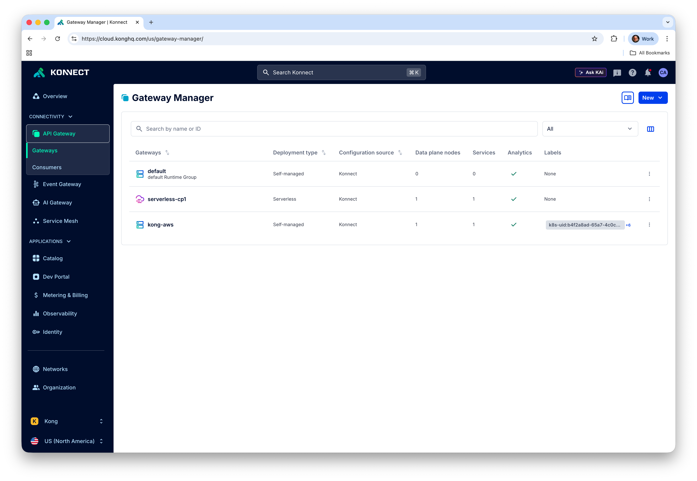
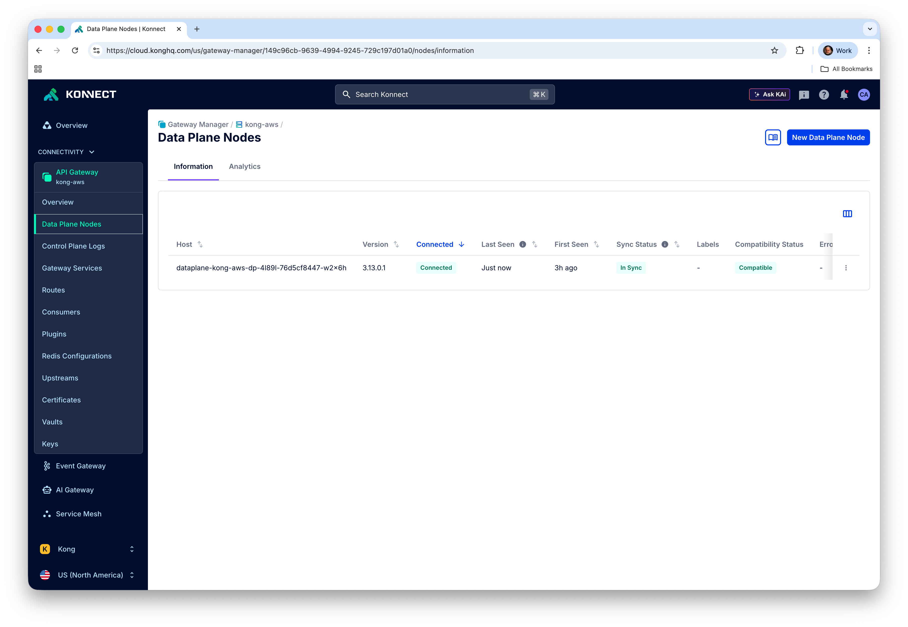

# Kong

Now it's time to create the Konnect Control Plane and deploy the Data Plane in our EKS Cluster.

## Pod Identity

```
aws iam create-policy \
 --policy-name bedrock-policy \
 --policy-document '{
	"Version": "2012-10-17",
	"Statement": [
		{
			"Effect": "Allow",
			"Action": [
				"bedrock:InvokeModel",
				"bedrock:InvokeModelWithResponseStream",
				"bedrock:ApplyGuardrail",
				"bedrock:CallWithBearerToken",
				"bedrock-agentcore:InvokeAgentRuntime",
				"bedrock-agentcore:GetAgentCard",
				"secretsmanager:ListSecrets",
				"secretsmanager:GetSecretValue"
			],
			"Resource": "*"
		}
	]
}'
```

```
kubectl delete namespace kong

kubectl create namespace kong
kubectl create sa kaigateway-podid-sa -n kong
```

### Define PodIdentityAssociation
```
eksctl create podidentityassociation \
  --cluster kong313 \
  --region us-west-2 \
  --namespace kong \
  --service-account-name kaigateway-podid-sa \
  --role-name kaigateway-aws-podid-role \
  --permission-policy-arns arn:aws:iam::481711488351:policy/bedrock-policy
```

## Kong Operator

Install the [Kong Operator](https://developer.konghq.com/operator/)

```
helm repo add kong https://charts.konghq.com
helm repo update kong
```

```
helm upgrade --install kong-operator kong/kong-operator \
-n kong-system \
--create-namespace \
--set image.tag=2.1.5 \
--set kubernetes-configuration-crds.enabled=true \
--set env.ENABLE_CONTROLLER_KONNECT=true
```

You can check the Operator’s log with:
```
kubectl logs -f $(kubectl get pod -n kong-system -o json | jq -r '.items[].metadata | select(.name | startswith("kong-operator"))' | jq -r '.name') -n kong-system
```


## Konnect Personal Access Token (PAT)

In order to start using the Kong Operator, you need to issue a Konnect Personal Access Token (PAT) or a System Access Token (SAT). To generate your PAT, go to Konnect UI, click on your initials in the upper right corner of the Konnect home page, then select "Personal Access Tokens." Click on "+ Generate Token," name your PAT, set its expiration time, and be sure to copy and save it as an environment variable also named as PAT. Konnect won’t display your PAT again.

```
export PAT=<YOUR_PAT>
```


## Control Plane

Now, you can create your Control Plane with the first Kong Operator declaration. The first CRD tells the Operator which Konnect region you’re using, and what token (PAT or SAT) to use to authenticate.

```
cat <<EOF | kubectl apply -f -
kind: KonnectAPIAuthConfiguration
apiVersion: konnect.konghq.com/v1alpha1
metadata:
  name: konnect-api-auth-conf
  namespace: kong
spec:
  type: token
  token: $PAT
  serverURL: us.api.konghq.com
EOF
```


The second CRD creates the new Control Plane:

```
cat <<EOF | kubectl apply -f -
kind: KonnectGatewayControlPlane
apiVersion: konnect.konghq.com/v1alpha2
metadata:
 name: kong-aws
 namespace: kong
spec:
  createControlPlaneRequest:
    name: kong-aws
  konnect:
    authRef:
      name: konnect-api-auth-conf
EOF
```


You can check your Data Plane in Konnect UI:


## Data Plane

The next CRD creates the Data Plane Configuration required to connect to the Control Plane.

```
cat <<EOF | kubectl apply -f -
kind: KonnectExtension
apiVersion: konnect.konghq.com/v1alpha2
metadata:
 name: konnect-config-aws
 namespace: kong
spec:
 clientAuth:
   certificateSecret:
     provisioning: Automatic
 konnect:
   controlPlane:
     ref:
       type: konnectNamespacedRef
       konnectNamespacedRef:
         name: kong-aws
EOF
```

Finally, the next CRD deploys the Data Plane asking for a NLB. Make sure you have the CERTIFICATE_ARN env variable set so the NLB has the previously created Digital Certificate attached:

```
cat <<EOF | kubectl apply -f -
apiVersion: gateway-operator.konghq.com/v1beta1
kind: DataPlane
metadata:
 name: kong-aws-dp
 namespace: kong
spec:
 extensions:
 - kind: KonnectExtension
   name: konnect-config-aws
   group: konnect.konghq.com
 deployment:
   podTemplateSpec:
     spec:
       containers:
       - name: proxy
         image: kong/kong-gateway:3.14
 network:
   services:
     ingress:
       name: proxy-kong-aws
       ports:
       - name: https
         port: 443
         targetPort: 8000
       - name: http
         port: 80
         targetPort: 8000
       type: LoadBalancer
       annotations:
         "service.beta.kubernetes.io/aws-load-balancer-type": "nlb"
         "service.beta.kubernetes.io/aws-load-balancer-scheme": "internet-facing"
         "service.beta.kubernetes.io/aws-load-balancer-nlb-target-type": "ip"
         service.beta.kubernetes.io/aws-load-balancer-ssl-cert: $CERTIFICATE_ARN
         service.beta.kubernetes.io/aws-load-balancer-ssl-ports: "443"
         service.beta.kubernetes.io/aws-load-balancer-listen-ports: '[{"HTTP":80},{"HTTPS":443}]'
         service.beta.kubernetes.io/aws-load-balancer-ssl-negotiation-policy: ELBSecurityPolicy-TLS-1-2-2017-01
         service.beta.kubernetes.io/aws-load-balancer-backend-protocol: "http"
EOF
```

Check the Data Plane deployment with:

```
kubectl get -n kong dataplane kong-aws-dp \
  -o=jsonpath='{.status.conditions[?(@.type=="Ready")]}' | jq
```

You can check the Data Plane's log with:
```
kubectl logs -f $(kubectl get pod -n kong -o json | jq -r '.items[].metadata | select(.name | startswith("dataplane-kong-aws"))' | jq -r '.name') -n kong
```

You should see your Data Plane in Konnect UI:




#### Check the Load Balancer Listener

If you want, you can check your Load Balancer Listeners. Use the Load Balancer created during the deployment:

```
export DATA_PLANE_LB=$(kubectl get service -n kong proxy-kong-aws --output=jsonpath='{.status.loadBalancer.ingress[].hostname}')
```

Get the Load Balancer ARN
```
export LB_ARN=$(aws elbv2 describe-load-balancers \
  --region us-west-2 \
  --query "LoadBalancers[?DNSName=='$DATA_PLANE_LB'].LoadBalancerArn" \
  --output text)
```

Check the Listeners
```
aws elbv2 describe-listeners \
  --region us-west-2 \
  --load-balancer-arn $LB_ARN \
  --query "Listeners[].{Port:Port,Protocol:Protocol}" \
  --output table
```


## Route53
The last step is responsible for registering the DNS record to AWS Route53.

#### Get the Data Plane Load Balancer Name

Using the Load Balancer Hostname, get its Name
```
export LB_NAME=$(aws elbv2 describe-load-balancers \
  --region us-west-2 \
  --query "LoadBalancers[?DNSName=='$DATA_PLANE_LB'].LoadBalancerName" \
  --output text)
```


#### Get the Load Balancer Hosted Zone Ids

```
export LB_HOSTED_ZONE_ID=$(aws elbv2 describe-load-balancers \
  --region us-west-2 \
  --names $LB_NAME \
  --query "LoadBalancers[0].CanonicalHostedZoneId" \
  --output text)
```


Now, using boths Hosted Zone Ids, create an alias, named ``kong-dp.$AWS-DOMAIN`` to the Load Balancer deployed. Make sure you have the HOSTED_ZONE_ID env variable set as we did in the previous step.

```
aws route53 change-resource-record-sets \
  --hosted-zone-id $HOSTED_ZONE_ID \
  --change-batch '{
      "Comment": "Create alias record to NLB",
      "Changes": [{
          "Action": "UPSERT",
          "ResourceRecordSet": {
              "Name": "'"kong-dp.$AWS_DOMAIN"'",
              "Type": "A",
              "AliasTarget": {
                  "HostedZoneId": "'"$LB_HOSTED_ZONE_ID"'",
                  "DNSName": "'"$DATA_PLANE_LB"'",
                  "EvaluateTargetHealth": true
              }
          }
      }]
  }'
```

## Test the Load Balancers

Test HTTP:

```
curl http://kong-dp.$AWS_DOMAIN
```

Test HTTP/S:
```
curl -i https://kong-dp.$AWS_DOMAIN
```

```
HTTP/1.1 404 Not Found
Date: Tue, 28 Apr 2026 18:56:30 GMT
Content-Type: application/json; charset=utf-8
Connection: keep-alive
Content-Length: 103
X-Kong-Response-Latency: 0
Server: kong/3.14.0.0-enterprise-edition
X-Kong-Request-Id: 3c38636dfcb2140c62665b654455083c

{
  "message":"no Route matched with those values",
  "request_id":"3c38636dfcb2140c62665b654455083c"
}
```


### Delete CP/DP
```
kubectl delete dataplane kong-aws-dp -n kong
kubectl delete konnectextensions.konnect.konghq.com konnect-config-aws -n kong


kubectl delete konnectgatewaycontrolplane kong-aws -n kong
kubectl delete konnectapiauthconfiguration konnect-api-auth-conf -n kong


kubectl delete secret konnect-pat -n kong
kubectl delete namespace kong
```