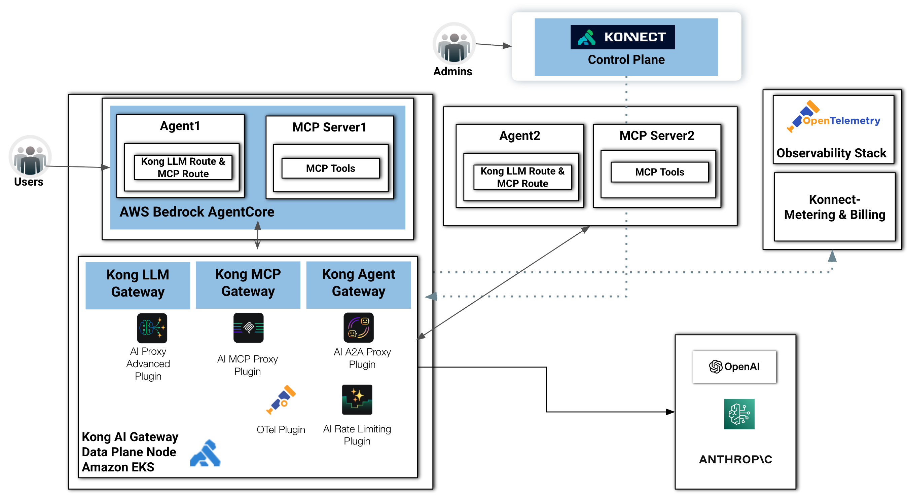

# Kong AI Gateway and Amazon Bedrock AgentCore

This architecture illustrates a production-ready AI and agentic application platform built on top of the **Kong Konnect Platform** and **Amazon Bedrock AgentCore**, integrating AI gateways, MCP-based tool orchestration, agent-to-agent communication, observability, and centralized governance across distributed environments.

At the core of the design is the separation between the control plane and the distributed AI execution environments. The centralized **Konnect Control Plane** provides administrative governance, configuration management, policy distribution, observability integration, and metering capabilities for all AI traffic and agent interactions across the platform. Administrators use this layer to manage APIs, AI routing policies, security controls, telemetry, and operational governance consistently across clusters and environments.

On the execution layer, the architecture deploys **Kong AI Gateway** components into Amazon EKS-based data plane nodes, providing scalable and secure runtime enforcement for AI workloads. The platform exposes three specialized gateway capabilities:

* **Kong LLM Gateway** for managing and routing requests to large language model providers such as OpenAI and Anthropic
* **Kong MCP Gateway** for securely exposing and governing Model Context Protocol (MCP) servers and tools
* **Kong Agent Gateway** for enabling Agent-to-Agent (A2A) communication patterns and intelligent orchestration between distributed AI agents

Within the **Amazon Bedrock AgentCore** environment, Agent1 interacts with external LLM providers and MCP tools through Kong-managed LLM and MCP routes. MCP Server1 exposes tool interfaces that can be securely consumed by agents while remaining governed through centralized gateway policies. This pattern enables standardized authentication, rate limiting, observability, and policy enforcement across all tool invocations and model interactions.

A second execution environment demonstrates the hybrid, distributed and multi-agent nature of the architecture. Agent2 and MCP Server2 operate independently running on different runtimes.

## Kong AI Gateway
Through the **Kong Agent Gateway** and AI A2A Proxy capabilities, agents can securely communicate, delegate tasks, and exchange contextual workflows across environments and clusters.

The architecture also incorporates enterprise-grade operational controls through:
* OpenTelemetry-based distributed tracing and observability
* AI-aware rate limiting and traffic governance
* Centralized metering and billing
* Unified policy enforcement across AI providers and agent ecosystems

By abstracting AI providers, MCP tool servers, and agent communication behind **Kong AI Gateway** layer, the platform delivers a secure, observable, and extensible foundation for enterprise AI adoption. This approach enables organizations to standardize AI governance while supporting heterogeneous LLM providers, distributed agent frameworks, and rapidly evolving MCP ecosystems without tightly coupling applications to individual vendors or protocols.

## Amazon Bedrock AgentCore
Within this architecture, **AWS Bedrock AgentCore** acts as the runtime environment responsible for hosting and executing enterprise AI agents and MCP Servers.

**AgentCore** provides the execution framework where agents maintain conversational state, reasoning logic, task orchestration, and tool invocation capabilities. Rather than directly embedding connectivity logic to individual LLM providers or MCP services, agents running inside AgentCore rely on the **Kong AI Gateway** layer for external communication, governance, and policy enforcement.

In this design, **AgentCore** serves several important functions:
* **LLM** Abstraction and Provider Independence: Instead of tightly coupling agents to a specific model provider, **AgentCore** delegates LLM access through **Kong LLM Gateway** routes. This abstraction enables dynamic routing across providers such as OpenAI and Anthropic while supporting governance policies like rate limiting, failover, token tracking, and traffic control.
* **Tool** Orchestration through MCP: Agents running in **AgentCore** interact with MCP Servers through **Kong MCP Gateway** routes. This allows agents to discover and consume MCP tools using standardized protocols while keeping security, authentication, and observability centralized at the gateway layer.
* **Agent** Runtime Execution: AgentCore hosts the lifecycle of AI agents, including prompt orchestration, reasoning chains, memory management, and workflow execution. Agents can coordinate multi-step tasks while dynamically invoking external tools and models.
* **Multi-Agent** Coordination: **AgentCore** enables multiple agents to operate collaboratively across distributed environments. Through the **Kong Agent Gateway** and A2A proxy capabilities, agents can securely communicate with other agents, delegate subtasks, and participate in broader agentic workflows.

In summary, **AgentCore** focuses on agent execution logic while **Kong** handles cross-cutting concerns such as authentication, authorization, observability, telemetry export, metering, and AI governance. This separation of responsibilities simplifies agent development while strengthening operational control.
