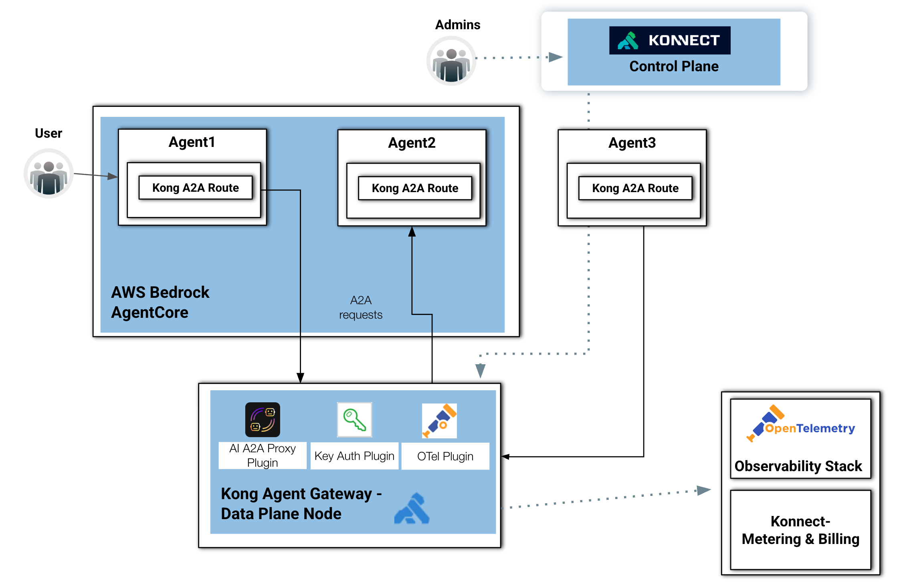

# The A2A Flow

This diagram illustrates a secure and observable Agent-to-Agent (A2A) communication architecture built using **AWS Bedrock AgentCore**, **Kong Agent Gateway**, and **Konnect** as the centralized control plane.



The design demonstrates how multiple AI agents can communicate with one another through standardized **A2A Protocol** and routes while Kong provides governance, authentication, telemetry, and operational control.

On the left side, a User initiates requests that are handled by an AI agent running inside AWS Bedrock AgentCore.

Within the AgentCore environment there are two agents. Each agent consumes a Kong A2A Route, representing a gateway-managed endpoint for agent-to-agent communication.

This means the agents are not communicating directly through unmanaged channels. Instead, all interactions pass through Kong-governed A2A routes, enabling:

* security enforcement,
* observability,
* authentication,
* traffic control,
* and policy management.

## Internal Agent and External / Federated Agent Communications

As you can see in the diagram, Agent1 exists outside the AWS Bedrock AgentCore boundary and consumes a Kong A2A Route, allowing it to participate in the same governed communication framework.

It sends requests toward Agent2 through the Kong-managed A2A route which are routed downward into the Kong Agent Gateway Data Plane Node before reaching the target agent.

This demonstrates:
* federated agent architectures,
* multi-runtime agent ecosystems,
* or cross-environment AI interoperability.

Also, it creates a secure hub-and-spoke architecture for distributed Agentic Application Systems.


## Kong Agent Gateway

At the center-bottom is the Kong Agent Gateway, which acts as the runtime enforcement and routing layer for all A2A traffic.

The gateway contains several important plugins:

* **AI A2A Proxy Plugin**: This is the core plugin responsible for:
    * brokering agent-to-agent communication
    * routing A2A protocol traffic
    * mediating requests between agents
    * standardizing communication semantics

* **Key Auth Plugin**: The Key Authentication Plugin secures communication between agents by enforcing:
    * API keys
    * identity validation
    * access policies

* **OTel Plugin**: The OpenTelemetry Plugin exports metrics, logs and traces. This enables deep observability into:
    * agent execution
    * inter-agent latency
    * request flows
    * failures
    * operational performance

## Kong Konnect Plugins

One of the main capabilities the Kong Gateway provides is extensibility. An extensive list of plugins allows you to implement specific policies to protect and control the APIs deployed in the gateway. The plugins offload critical and complex processing usually implemented by backend services and apps. With the Gateway and its plugins in place, the backend services can focus on business logic only, leading to a faster app development processes. Each plugin is responsible for specific functionality, including:

* Authentication/authorization to implement security mechanisms such as basic authentication, LDAP, mutual TLS (mTLS), API key, open policy agent (OPA)-based access control policies, etc.
* Traffic control to implement canary releases, mocking endpoints, and routing policies based on request headers, etc.
* Transformations to transform requests before routing them to the upstreams and to transform responses before returning to the consumers.
* Proxy Caching Advanced and GraphQL Proxy Caching Advanced cache and serve requested responses.
* Rate limiting, rate limiting advanced, service protection, and GraphQL rate limiting advanced – rate limit how many HTTP requests can be made in a given time frame.
* OpenID Connect and Upstream OAuth for session storage and token caching.
* Integration with Kafka-based data/event streaming infrastructures.
* WebSockets Size Limit and WebSockets Validator plugins to control the events sent by the devices for IoT projects where MQTT over WebSockets connections are extensively used.


### Kong AI gateway plugins

On the other hand, Kong AI Gateway leverages the existing Kong API Gateway extensibility model to provide specific AI-based plugins more precisely to protect LLM infrastructures, including:

* **AI Proxy** and **AI Proxy Advanced** plugins use multi-LLM capability to abstract and load balance multiple LLM models based on policies, including latency time, model usage, semantics, etc.
* Prompt engineering templates:
    * **AI Prompt Template** plugin is responsible for pre-configuring AI prompts to users.
    * **AI Prompt Decorator** plugin injects messages at the start or end of a caller’s chat history.
    * **AI Prompt Guard** plugin lets you configure a series of PCRE-compatible regular expressions to allow and block specific prompts, words, phrases, etc and have more control over an LLM service.
    * **AI Semantic Prompt Guard** plugin enables self-configurable semantic (or pattern-matching) prompt protection.
* **AI Semantic Cache** plugin caches responses based on threshold to improve performance (and therefore end-user experience) while optimizing for cost.
* **AI Rate Limiting Advanced** lets you tailor per-user or per-model policies based on the tokens returned by the LLM provider or craft a custom functions to count the tokens for requests.
* **AI Request Transformer** and **AI Response Transformer** plugins seamlessly integrate with LLMs, enabling introspection and transformation of a request’s body before proxying it to the upstream service prior to forwarding the response to the client.
* **MCP Proxy** and **MCP OAuth2** abstract and protect MCP Servers and RESTful API.


## Konnect Control Plane

At the top-right, administrators interact with the Konnect Control Plane. The dotted management connection indicates that Konnect centrally manages Kong Agent Gateway configuration, including A2A routes, plugin policies, authentication settings, etc.

Konnect distributes configuration to the Kong data plane nodes without being directly involved in runtime traffic.

## Observability and Metering

Konnect provides out-of-the box Observability capabilities, including dashboard, reports, etc. At the sames, as described in the diagram, telemetry and usage data can be exported to external OpenTelemetry Observability Stack. Similarly, Konnect Metering & Billing service can be used to chargeback or quota enforcement.


# The A2A Protocol

The official [Agent2Agent (A2A) Protocol](https://a2a-protocol.org/) portal defines it as follows:
"The A2A protocol is an open standard that enables seamless communication and collaboration between AI agents."

Conceptually, A2A, announced by [Google in April 2025](https://developers.googleblog.com/en/a2a-a-new-era-of-agent-interoperability), treats agents as networked participants that exchange structured requests and responses around tasks and outcomes instead of exposing internal implementation details. This model aligns naturally with controller/task-worker architectures: a coordinating agent can decompose work, assign subtasks to specialized agents, monitor progress, and aggregate results. By separating orchestration from execution, A2A supports scalable multi-agent systems where capabilities can evolve independently while maintaining a consistent communication contract.

The lastest [A2A 1.0 Protocol Specification](https://a2a-protocol.org/v1.0.0/specification/) page provides a nice introduction including [main concepts and main components](https://a2a-protocol.org/v1.0.0/topics/key-concepts/).


## The first Agent

To get started consider this [basic Agent](../assets/code/server_1.0.py):

```
mkdir server
cd server

uv init

uv venv --python 3.13
source .venv/bin/activate

python3 --version


uv add uvicorn "a2a-sdk[all]" --python 3.13


python3 -c "import a2a; print('A2A SDK imported successfully')"


uv pip freeze | grep a2a
a2a-sdk==1.0.3


python3 server_1.0.py


kubectl port-forward service/a2aserver 9999
curl -s http://127.0.0.1:9999/.well-known/agent-card.json | jq
curl -s http://kong-dp.kong-demo.com/.well-known/agent-card.json | jq


curl -X POST http://127.0.0.1:9999/agent1/a2a \
    --no-progress-meter --fail-with-body  \
     -H "Content-Type: application/json" \
     --json '{
       "jsonrpc": "2.0",
       "id": "1",
       "method": "message/send",
       "params": {
         "message": {
           "kind": "message",
           "messageId": "msg-001",
           "role": "user",
           "parts": [
             {
               "kind": "text",
               "text": "How much is 100 USD in EUR?"
             }
           ]
         }
       }
     }'


curl -X POST http://127.0.0.1:9999/ \
  -H "Content-Type: application/json" \
  -d '{
    "jsonrpc": "2.0",
    "id": "1",
    "method": "message/send",
    "params": {
      "message": {
        "messageId": "msg-1",
        "role": "user",
        "parts": [{"kind": "text", "text": "hi"}]
      }
    }
  }'


curl kong-dp.kong-demo.com


curl -X POST http://kong-dp.kong-demo.com/v1/a2a/Translate-Poetagent \
curl -sX POST http://kong-dp.kong-demo.com/.well-known/agent-card.json \
    --no-progress-meter --fail-with-body  \
     -H "Content-Type: application/json" \
     --json '{
       "jsonrpc": "2.0",
       "id": "1",
       "method": "message/send",
       "params": {
         "message": {
           "kind": "message",
           "messageId": "msg-001",
           "role": "user",
           "parts": [
             {
               "kind": "text",
               "text": "How much is 100 USD in EUR?"
             }
           ]
         }
       }
     }'


curl -X POST http://127.0.0.1:9999/ \
  -H "Content-Type: application/json" \
  -d '{
    "jsonrpc": "2.0",
    "id": "1",
    "method": "tasks/get"
  }'


Docker


podman image rm claudioacquaviva/a2aserver
podman image rm docker.io/library/python:3.13.13

podman build --platform linux/amd64 -t claudioacquaviva/a2aserver .

podman container stop a2aserver
podman container rm a2aserver
podman run -d --name a2aserver -p 9999:9999 claudioacquaviva/a2aserver
podman logs -f a2aserver


podman login docker.io

podman push claudioacquaviva/a2aserver


kubectl port-forward service/a2aserver 9999


kubectl logs -f $(kubectl get pod -o json | jq -r '.items[].metadata | select(.name | startswith("a2aserver"))' | jq -r '.name')
kubectl logs -f $(kubectl get pod -n kong -o json | jq -r '.items[].metadata | select(.name | startswith("dataplane"))' | jq -r '.name') -n kong


EKS
kubectl delete -f deployment_a2aserver.yaml
kubectl apply -f deployment_a2aserver.yaml


Kong


deck gateway sync --konnect-control-plane-name kong-aws --konnect-token $PAT ai-a2a-proxy.yaml
```


```
import uuid

from starlette.applications import Starlette
import uvicorn

from a2a.server.agent_execution import AgentExecutor, RequestContext
from a2a.server.events import EventQueue
from a2a.server.request_handlers import DefaultRequestHandler
from a2a.server.tasks import InMemoryTaskStore
from a2a.server.routes.agent_card_routes import create_agent_card_routes
from a2a.server.routes.jsonrpc_routes import create_jsonrpc_routes

from a2a.types import (
    AgentCapabilities,
    AgentCard,
    AgentInterface,
    AgentSkill,
    TaskArtifactUpdateEvent,
    TaskState,
)
from a2a.helpers import new_text_artifact, new_task


class HelloWorldAgentExecutor(AgentExecutor):
    async def execute(
        self,
        context: RequestContext,
        event_queue: EventQueue,
    ) -> None:
        task = context.current_task or new_task(
            task_id=context.task_id or str(uuid.uuid4()),
            context_id=context.context_id or str(uuid.uuid4()),
            state=TaskState.TASK_STATE_SUBMITTED,
            history=[context.message] if context.message else None,
        )
        await event_queue.enqueue_event(task)

        result = "that's the response"

        await event_queue.enqueue_event(
            TaskArtifactUpdateEvent(
                task_id=context.task_id,
                context_id=context.context_id,
                artifact=new_text_artifact(name='result', text=result),
            )
        )

    async def cancel(
        self,
        context: RequestContext,
        event_queue: EventQueue,
    ) -> None:
        raise Exception('cancel not supported')


if __name__ == '__main__':
    skill = AgentSkill(
        id='hello_world',
        name='Returns hello world',
        description='just returns hello world',
        tags=['hello world'],
        examples=['hi', 'hello world'],
    )

    agent_card = AgentCard(
        name='Hello World Agent',
        description='Just a hello world agent',
        version='1.0.0',
        icon_url='http://localhost:9999/icon.png',
        supported_interfaces=[
            AgentInterface(
                url='http://localhost:9999/a2a',
                protocol_binding='JSONRPC',
                protocol_version='0.3',
            ),
        ],
        default_input_modes=['text'],
        default_output_modes=['text'],
        capabilities=AgentCapabilities(streaming=True),
        skills=[skill],
    )

    request_handler = DefaultRequestHandler(
        agent_card=agent_card,
        agent_executor=HelloWorldAgentExecutor(),
        task_store=InMemoryTaskStore(),
    )

    routes = [
        *create_agent_card_routes(agent_card=agent_card),
        *create_jsonrpc_routes(
            request_handler=request_handler,
            rpc_url='/a2a',
            enable_v0_3_compat=True,
        ),
    ]

    app = Starlette(routes=routes)
    uvicorn.run(app, host='0.0.0.0', port=9999)
```

# Agent1

```
import asyncio
import httpx
from a2a.client import A2ACardResolver, ClientFactory, ClientConfig
from a2a.types import (
    Message,
    Part,
    TextPart,
    Role,
    TransportProtocol,
)

from uuid import uuid4


async def main():
    base_url = 'http://kong-dp.kong-demo.com/a2a'

    api_key = "abcde"

    async with httpx.AsyncClient( headers={"apikey-a2a": api_key}, timeout=60.0 ) as httpx_client:
        # 1. Resolve the agent card
        resolver = A2ACardResolver(
            httpx_client=httpx_client,
            base_url=base_url,
        )
        agent_card = await resolver.get_agent_card()
        print("----- Agent Card -----")
        print(agent_card.model_dump_json(indent=2))
        print("----- Agent Card -----")

        # 2. Create client via ClientFactory
        factory = ClientFactory(
            ClientConfig(
                supported_transports=[TransportProtocol.jsonrpc],
                use_client_preference=True,
                httpx_client=httpx_client,
            )
        )
        client = factory.create(agent_card)

        # 3. Send Messages
        print("\nAgent ready. Type 'quit' to exit.\n")
        while True:
            try:
                prompt = input("User: ")
            except (EOFError, KeyboardInterrupt):
                break
            if prompt.strip().lower() in ("quit", "exit"):
                break
            message = Message(
                role=Role.user,
                parts=[Part(root=TextPart(text=prompt))],
                messageId=str(uuid4()),
            )

            async for event in client.send_message(message):
                if isinstance(event, Message):
                    for part in event.parts:
                        print(part.root.text)
                else:
                    task, update = event
                    print(task)


asyncio.run(main())
```