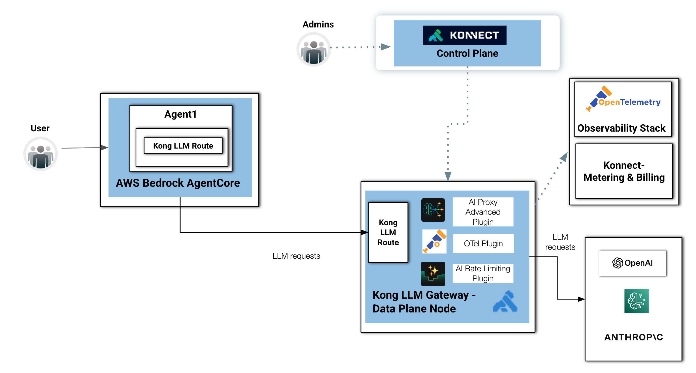

# The LLM/GenAI Flow

The diagram illustrates a LLM/GenAI request flow where an Agent running on **Amazon Bedrock AgentCore** delegates all LLM traffic through a centralized Kong AI Gateway for governance, observability, security, and policy enforcement before reaching external model providers.

The main steps of the flow are:
1. User interacts with the AI Agent: A user sends a request to an Agent hosted inside **AgentCore**.
2. Agent generates LLM requests: Inside the Agent, a Kong LLM Route abstracts access to external LLM providers.
3. Requests are forwarded to the Kong LLM Gateway Data Plane: This layer provides consistent governance and operational controls for all GenAI traffic.
4. **Kong LLM Gateway** applies AI-specific policies and plugins: Before forwarding the request to an LLM provider, the gateway executes several policies and plugins, including, for example:
    * OpenTelemetry (OTel) Plugin: Generates telemetry data such as traces, metrics, latency, token usage, and request spans for observability platforms.
    * AI Rate Limiting Plugin: Enforces token, request, or consumer-level limits to control cost, and protect provider quotas.
5. **Kong LLM Gateway** forwards requests to external LLM providers: After policy enforcement, the **Kong LLM Gateway** sends the LLM request to external model providers such as **Amazon Bedrock**, **OpenAI** and **Anthropic**. The gateway becomes the single controlled entry point for all outbound LLM traffic.
6. LLM responses return through the same path: Responses from the model providers flow back through the **Kong LLM Gateway** and then return to the **AgentCore** Agent, which processes the result and delivers the final response to the user.

## Architectural Benefits

This architecture provides several important advantages for enterprise GenAI deployments:

* Centralized LLM/GenAI governance
* Provider abstraction and portability
* Unified observability
* Token and cost control
* Rate limiting and security enforcement
* Standardized LLM access patterns
* Operational separation between control plane and runtime data plane
* Easier multi-model and multi-provider adoption

The result is a production-grade GenAI architecture where AI agents can safely consume multiple LLM providers while all traffic is centrally governed through **Kong LLM Gateway** and **Konnect**.

