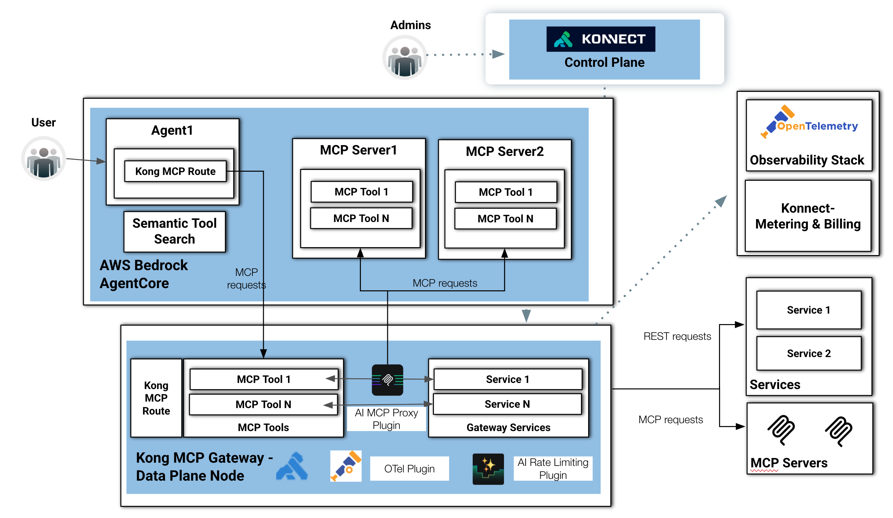

# The MCP Flow


This diagram illustrates an AI-native architecture that combines AWS Bedrock AgentCore, Kong MCP Gateway, and MCP (Model Context Protocol) Servers to provide secure, observable, and governable access to tools and services for AI agents.




At a high level, the flow is divided into four major domains:

⸻

1. User and Agent Runtime Layer

On the left side, a User interacts with an AI application running inside AWS Bedrock AgentCore.

Inside the AgentCore environment:

* Agent1 represents an AI agent responsible for orchestrating requests and interacting with external capabilities.
* The agent communicates through a Kong MCP Route, which acts as the controlled entry point for MCP-based interactions.
* A Semantic Tool Search component enables the agent to dynamically discover the most relevant MCP tools at runtime instead of relying on static integrations.

This creates a flexible agentic architecture where tools can be selected semantically based on the user request and context.

⸻

2. MCP Server Layer

Within the same AgentCore environment, there are multiple MCP servers:

* MCP Server1
* MCP Server2

Each MCP server exposes one or more MCP tools:

* MCP Tool 1
* MCP Tool N

These tools represent callable capabilities such as:

* APIs
* retrieval functions
* automation actions
* enterprise integrations
* data access services

The diagram shows MCP requests flowing from the agent to these MCP servers, demonstrating how the agent dynamically invokes external capabilities using the MCP protocol.

⸻

3. Kong MCP Gateway (Data Plane)

The lower section represents the Kong MCP Gateway Data Plane Node, which acts as the centralized runtime gateway for MCP traffic.

This layer includes several important components:

Kong MCP Route

The gateway exposes MCP-compatible routes that receive requests from agents and MCP servers.

MCP Tools

The gateway can directly expose MCP tools itself, allowing Kong to behave as an MCP-native gateway endpoint.

AI MCP Proxy Plugin

This plugin is the core intelligence layer inside Kong. It:

* translates and proxies MCP requests,
* brokers communication between agents and services,
* standardizes tool invocation,
* and enables policy enforcement.

Gateway Services

The gateway forwards requests to backend services:

* Service 1
* Service N

These services can be:

* REST APIs,
* internal enterprise systems,
* databases,
* external SaaS platforms,
* or additional MCP servers.

⸻

4. Governance, Security, and Observability

The architecture emphasizes centralized governance and operational visibility.

Konnect Control Plane

At the top, administrators manage the platform through the Konnect Control Plane.

This control plane:

* configures routes,
* manages plugins,
* distributes policies,
* and controls the Kong data plane nodes.

Observability Stack

On the right side:

* the OpenTelemetry stack receives telemetry exported through the OTel Plugin.
* This enables distributed tracing, metrics, and logging for AI and MCP traffic.

Konnect Metering & Billing

Usage information is exported for:

* chargeback,
* quota management,
* cost visibility,
* and AI consumption analytics.

AI Rate Limiting Plugin

The gateway also includes an AI-focused rate limiting plugin that protects:

* LLM endpoints,
* MCP tools,
* and backend services from abuse or excessive consumption.

⸻

5. External Services and MCP Servers

On the far right, the architecture integrates with external environments:

REST Services

Standard REST requests are forwarded to traditional backend services.

External MCP Servers

The gateway can also proxy and federate requests to external MCP servers, enabling:

* tool federation,
* multi-domain agent ecosystems,
* and distributed agent architectures.

⸻

Architectural Significance

This design demonstrates how:

* AWS Bedrock AgentCore provides the agent runtime,
* Kong MCP Gateway provides governance and secure connectivity,
* and MCP servers provide interoperable tools and capabilities.

The overall architecture enables:

* dynamic tool discovery,
* centralized policy enforcement,
* observability,
* rate limiting,
* protocol mediation,
* and scalable multi-agent interoperability.

It effectively turns Kong into an AI-native control and data plane for MCP ecosystems.


With the Kong API Gateway Data Plane deployed, we need to configure it exposing an application. For the Development Time, one good option is to mock the application using the [**Kong Mocking Plugin**](https://developer.konghq.com/plugins/mocking/).


With the **Mocking Plugin** we can have a much faster and easier deployment since we don't need to provide actual upstream services or applications.


The **Mocking Plugin** takes an **OpenAPI** specification to mock and expose the application.

The **OpenAPI Spec** we are going to use is [here](../openapi.yml).


## Kong Mocking Plugin

The **decK** (Declarations for Kong) tool is used to configure the **Mocking Plugin**

The **Mocking Plugin** configuration takes the **OpenAPI** specification and defines a **Kong Service** and a **Kong Route**. Note the **Kong Service** is ignored since the **Mocking Plugin** is going to manage the requests. The **decK** file can be found [here](../kong_aws_mock.yaml)


```
deck gateway reset --konnect-control-plane-name kong-aws --konnect-token $PAT -f
deck gateway sync --konnect-control-plane-name kong-aws --konnect-token $PAT kong_aws_mock.yaml
```


## Test the Kong API Gateway Routes

Set the ``DATA_PLANE_LB`` environment variable with domain name:

```
export DATA_PLANE_LB=kong-dp.$AWS_DOMAIN
```

You can use any of these requests to tests the Routes and the Mocking Application:

```
curl -s -X POST https://$DATA_PLANE_LB/api/dataio/getTypeNames | jq
curl -s -X POST https://$DATA_PLANE_LB/api/dataio/getTypeDefinitions | jq
curl -s -X POST https://$DATA_PLANE_LB/api/dataio/createRecord | jq
curl -s -X POST https://$DATA_PLANE_LB/api/dataio/patchRecord | jq
curl -s -X POST https://$DATA_PLANE_LB/api/dataio/searchRecords | jq
curl -s -X POST https://$DATA_PLANE_LB/api/oauth/token | jq
```

For example, the following request:
```
curl -s -X POST https://$DATA_PLANE_LB/api/dataio/getTypeNames | jq
```

Should return this:
```
{
  "typeNames": [
    {
      "label": "CRM Contact",
      "typeName": "Contact"
    },
    {
      "label": "Sales Opportunity",
      "typeName": "Opportunity"
    }
  ]
}
```

