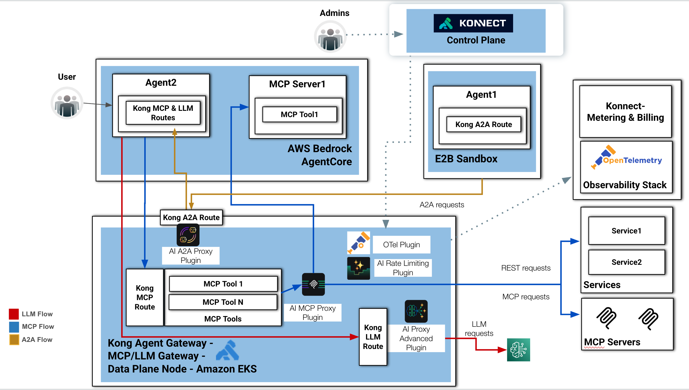

# The Agentic AI Application

This diagram presents a comprehensive AI Gateway architecture that combines LLM routing, MCP tool orchestration, and Agent-to-Agent (A2A) communication using Kong Gateway, AWS Bedrock AgentCore, and Amazon EKS.

The design demonstrates how a single gateway layer can unify:

* AI model access,
* MCP tool invocation,
* multi-agent communication,
* observability,
* security,
* and governance.

The architecture is divided into several interconnected domains.

⸻

1. User and Agent Runtime Layer

On the upper-left side, a User interacts with Agent2, which runs inside AWS Bedrock AgentCore.

Agent2 exposes:

* Kong MCP & LLM Routes

These routes allow the agent to:

* invoke LLMs,
* access MCP tools,
* and communicate with other agents through Kong-managed interfaces.

Within the same AgentCore environment there is also:

* MCP Server1, exposing:
    * MCP Tool1

This demonstrates that Bedrock AgentCore can host:

* agents,
* MCP servers,
* and tool runtimes together.

⸻

2. Kong Agent Gateway (Central Data Plane)

The bottom section represents the centralized runtime layer:

Kong Agent Gateway – MCP/LLM Gateway – Data Plane Node – Amazon EKS

This is the operational heart of the architecture.

The gateway runs on Amazon EKS and acts as:

* an AI gateway,
* an MCP gateway,
* and an A2A communication hub.

It centralizes all traffic mediation and policy enforcement.

⸻

3. Three Distinct Communication Flows

The diagram color-codes the different AI interaction patterns.

⸻

Red Flow — LLM Requests

The red arrows represent LLM traffic.

Flow:

1. Agent2 sends requests through Kong LLM Routes.
2. Requests enter the Kong LLM Route.
3. Traffic is processed by the:
    * AI Proxy Advanced Plugin
4. Requests are forwarded to external LLM providers.

The AI Proxy Advanced Plugin likely provides:

* model abstraction,
* provider routing,
* failover,
* retries,
* prompt governance,
* token management,
* and AI observability.

This effectively transforms Kong into an enterprise-grade LLM gateway.

⸻

Blue Flow — MCP Requests

The blue arrows represent MCP protocol communication.

Flow:

1. Agent2 invokes MCP tools through Kong MCP Routes.
2. Requests reach the Kong Gateway MCP layer.
3. MCP traffic is handled by the:
    * AI MCP Proxy Plugin
4. Requests are forwarded to:
    * internal MCP tools,
    * external MCP servers,
    * or traditional backend services.

The gateway exposes:

* MCP Tool1
* MCP Tool N

These tools are brokered through Kong before reaching:

* Services,
* REST APIs,
* or external MCP Servers.

This enables:

* centralized MCP governance,
* tool federation,
* dynamic tool discovery,
* and secure tool invocation.

⸻

Gold Flow — A2A Requests

The gold arrows represent Agent-to-Agent communication.

A2A requests pass through:

* the Kong A2A Route
* and the AI A2A Proxy Plugin

This allows:

* Agent2 (inside Bedrock AgentCore)
* and Agent1 (inside the E2B Sandbox)

to communicate securely through the gateway.

This creates a federated multi-agent environment where agents can operate across isolated runtimes.

⸻

4. E2B Sandbox Integration

On the upper-right side:

Agent1 inside E2B Sandbox

This demonstrates isolated agent execution environments.

The E2B Sandbox provides:

* secure code execution,
* isolated runtime environments,
* ephemeral workloads,
* and potentially tool execution containment.

Agent1 exposes a:

* Kong A2A Route

allowing it to participate in the governed agent ecosystem.

⸻

5. Plugins and Governance

The Kong data plane includes several AI-focused plugins.

⸻

AI A2A Proxy Plugin

Handles:

* agent-to-agent communication,
* routing,
* mediation,
* and interoperability.

⸻

AI MCP Proxy Plugin

Handles:

* MCP protocol routing,
* tool orchestration,
* MCP federation,
* and service translation.

⸻

AI Proxy Advanced Plugin

Handles:

* LLM traffic management,
* model abstraction,
* provider integration,
* and AI policy enforcement.

⸻

AI Rate Limiting Plugin

Protects:

* LLM providers,
* MCP tools,
* and agents from excessive consumption.

This is critical for:

* token cost control,
* abuse prevention,
* and platform stability.

⸻

OTel Plugin

Exports telemetry to the observability stack.

Provides:

* tracing,
* metrics,
* logs,
* and distributed AI observability.

⸻

6. External Integrations

On the right side, the gateway communicates with:

Traditional Services

Using:

* REST requests

External MCP Servers

Using:

* MCP requests

This demonstrates Kong acting as a unified interoperability layer between:

* AI agents,
* MCP ecosystems,
* APIs,
* and backend enterprise services.

⸻

7. Konnect Control Plane

At the top center:

Konnect Control Plane

Administrators manage:

* routes,
* plugins,
* security policies,
* observability,
* and gateway configuration.

The dotted lines indicate:

* control plane communication,
* separate from runtime data traffic.

This follows a classic:

* centralized control plane,
* distributed data plane architecture.

⸻

8. Observability and Metering

On the far right:

OpenTelemetry Observability Stack

Receives telemetry exported from the gateway.

Supports:

* distributed tracing,
* AI monitoring,
* request correlation,
* and operational analytics.

Konnect Metering & Billing

Tracks:

* AI usage,
* model consumption,
* MCP utilization,
* and potentially tenant billing.

⸻

Architectural Significance

This architecture illustrates a next-generation enterprise AI platform where Kong acts as:

* an LLM Gateway
* an MCP Gateway
* an Agent Gateway
* and an AI governance layer

across multiple execution environments.

The platform enables:

* governed LLM access,
* secure tool orchestration,
* multi-agent interoperability,
* protocol mediation,
* observability,
* and scalable AI infrastructure.

It effectively unifies:

* AI inference,
* agent orchestration,
* MCP ecosystems,
* and enterprise services

under a single API and policy control layer.