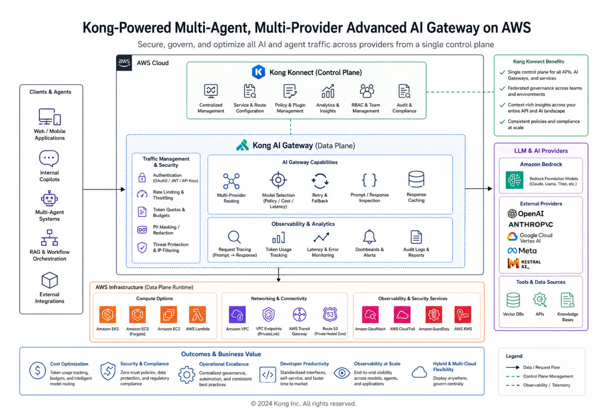

# Guidance for Multi-Agent, Multi-Provider Advanced AI Gateway on AWS

## Summary
The guide outlines how organizations can build a unified gateway to securely access and orchestrate multiple Generative AI (GenAI) providers in addition to emerging architectural patterns such as Model Context Protocol (MCP) for standardized tool and context exchange, Agent-to-Agent (A2A) communication for distributed AI Agents while maintaining governance, observability, and scalability. These patterns enable more advanced use cases, including multi-agent collaboration, tool chaining, and dynamic decision-making across heterogeneous AI services.

The guide provides a Reference Architecture, deployment considerations, and configuration steps. Designed for the Agentic Era, this guide is intended for Solution Architects, AI Engineers, Platform Teams, and Cloud computing professionals who want to deploy a secure, observable, and highly efficient **Kong AI Gateway**, including its **LLM Gateway**, **MCP Gateway** and **Agent Gateway** environments on Amazon Web Services (AWS).

## Overview
As enterprises move from simple GenAI applications to complex multi-agent systems, organizations need an AI connectivity layer that governs interactions safely and at machine speed.

This implementation guide provides instructions to deploy the **Kong AI Gateway** onto **Amazon Elastic Kubernetes Service (Amazon EKS)**. It aims to be pre-configured with defaults allowing users to rapidly spin up Kong's unified gateway, serving as a comprehensive “Context Mesh” that securely brings together APIs, Large Language Models (LLMs), Model Context Protocol (MCP) Servers, and autonomous agents.

It provides powerful features out-of-the-box, such as Semantic Caching, Semantic Routing across multi-providers, Agent-to-Agent (A2A) governance, Token-based Rate Limiting and advanced AI Cost Optimization (AI Metering and Billing).

The architecture extends beyond a traditional LLM proxy by incorporating the following complementary layers:

* **Konnect Control Plane**: responsible for defining APIs and Policies and pushing them to the Kong API Gateway Data Plane.
* **Kong Data Plane**: where the Kong AI Gateway resides.
* **Kong AI Gateway**: based on the Kong API Gateway, it comprehends all AI-based capabilities. Logically speaking, it can be divided into the LLM Gateway, MCP Gateway and Agent Gateway.
* **LLM Gateway** for unified access to multiple model providers.
* **MCP Gateway** to standardize tool and context exchange via the Model Context Protocol.
* **Agent Gateway** to orchestrate and govern autonomous and multi-agent systems, including Agent-to-Agent (A2A) communication.
* **Kong Identity**: plays the Identity Provider (IdP) role, implementing OAuth2 Grants, such as Authorization Code and Client Credentials.
* **Amazon Bedrock**: provides access to inference services through a unified API.
* **Amazon Bedrock AgentCore**: provides a managed runtime for executing, scaling, and coordinating AI Agents and MCP Servers.

Together, these components form a cohesive AI control plane that manages model inference, agent workflows, and contextual interactions across heterogeneous environments.

The solution integrates natively with **Amazon Bedrock** and **Amazon Bedrock AgentCore**, supporting foundation models, managed prompts, and conversation state. Enterprise-grade authentication is enabled through OAuth 2.0 and JWT-based identity providers (such as **Amazon Cognito** or **Kong Identity**), ensuring secure and scalable access for users, applications, and agents.

## Features and Benefits
This comprehensive platform delivers a unified enterprise solution for governing interactions across LLMs, MCP-enabled tools, and AI agents, enhanced by **Kong AI Gateway** and **AgentCore** as the execution backbone.

At its core, **Kong LLM Gateway** provides a single, consistent API layer for multiple LLM providers (Amazon Bedrock, OpenAI, Anthropic, etc.) and others—standardizing request and response formats across text generation, embeddings, TTS (Text-To-Speach), STT (Speach-To-Text) and multimodal workloads. It abstracts provider-specific APIs while maintaining flexibility and portability.

The **Kong Context Mesh and MCP Gateway** introduce a standardized interface for tools, plugins, and contextual data sources. This allows models and agents to dynamically discover and invoke external systems (such as APIs, databases, and enterprise services) in a secure and governed way, enabling composable and extensible AI applications.

The **Agent Gateway** enables orchestration, routing, and governance of AI Agents. It supports advanced patterns such as multi-agent collaboration and Agent-to-Agent (A2A) communication, allowing agents to coordinate tasks, share context, and delegate execution while remaining within policy boundaries.

**Bedrock AgentCore** complements this by acting as the managed execution layer for Agents and MCP Servers. It provides capabilities such as lifecycle management, tool execution, state handling, and scalable runtime environments for agents and workflows. This enables organizations to operationalize agent-based architectures with reliability, elasticity, and governance, without having to build custom orchestration engines from scratch.

The platform enables **centralized management** of usage across users, teams, applications, and agents. Administrators can define budgets, enforce rate limits, restrict access to specific models or tools, and implement fine-grained routing and policy controls. Intelligent traffic management includes load balancing, automatic failover, retry strategies, and caching to optimize both performance and cost.

**Security and compliance are foundational**. The solution integrates with **Amazon Bedrock Guardrails** and extends safety, validation, and policy enforcement across all LLM providers, MCP tools, and agent interactions. It supports secure credential handling, token-based authentication, and end-to-end authorization, ensuring that both human users and autonomous agents operate within defined constraints.

**Observability** features provide deep visibility into LLM calls, MCP tool usage, and agent workflows, including logs, metrics, and traces. This enables debugging, auditing, performance tuning, and governance at scale.

**Cost optimization mechanisms** include prompt and response caching, usage attribution across teams and agents, budget enforcement, and real-time monitoring of resource consumption.

All functionality is accessible via APIs and an intuitive administrative UI, allowing operators to manage configurations and policies, while developers and users can test models, invoke tools, and interact with agents.

## Use Cases
1. **Agentic Infrastructure Governance**: Provide a dedicated Agent Gateway to standardize A2A security and observability without changing how agents are built.
1. **MCP Server proxying and RESTful API abstraction**: Interact with upstream MCP servers or connect any Kong-managed Service to the Model Context Protocol (MCP), acting as a protocol bridge, translating between MCP and HTTP.
1. **Multi-Provider LLM Integration**: Focus on application logic rather than managing complex API calls. Seamlessly switch between different LLM providers (e.g., Amazon Bedrock, Azure OpenAI, Cohere) using a consistent interface.
1. **AI Cost Control**: Track token consumption across teams and models, set related budgets, and implement semantic caching to eliminate redundant LLM calls.
1. **Load Balancing**: Distribute high-volume inference requests across multiple LLM endpoints for superior performance and redundancy.

## Architecture Overview
The following outlines the reference implementation architecture for deploying the **Kong AI Gateway on AWS**.

### Architecture Steps
<!-- 1. **Traffic Ingress**: Client applications and autonomous agents access the **Kong AI Gateway** proxy API via an **Amazon Route 53** endpoint, protected against common web exploits using **AWS Web Application Firewall (WAF)**. -->
1. **Load Balancing**: Requests are sent a **Network Load Balancer (NLB)** which automatically distributes traffic to **Kong Data Plane** instances running as containers within **Amazon EKS** pods. TLS/SSL is secured using **AWS Certificate Manager (ACM)**.
1. **Kong AI Gateway Data Plane**: The deployed containers act as your high-performance, low-latency AI proxy. They process plugins natively (e.g., AI Proxy, AI Semantic Cache, AI Prompt Guard) before requests ever reach the foundation models.
1. **Control Plane (Kong Konnect)**: Kong Data Planes communicate securely with the **Kong Konnect Control Plane**. This provides platform teams with a centralized UI to push declarative configurations, monitor detailed AI analytics, and manage multi-tenant access.
1. **LLM Integrations**: Kong integrates natively with **Amazon Bedrock** to seamlessly handle prompt translation, model access, and routing to models like **Amazon Nova** or **Anthropic Claude**.
1. **Guardrails**: Kong leverages **Amazon Bedrock Guardrails** to apply compliance and safety polcies at the Gateway level.
1. **MCP Server Integrations**: Kong integrates with **Amazon Bedrock AgentCore** to protect and enforce policies related to the existing MCP Servers.
1. **A2A Integrations**: Agents deployed in **Amazon Bedrock AgentCore** will be able to, through the **Kong Agent Gateway**, interact with other existsing and external Agents.
1. **AWS Services Integration**:
    * **Amazon MemoryDB for Redis**: Acts as the high-speed backend for Kong's AI Semantic Caching, Semantic Routing and Semantic Prompt and Response Guards.
    * **AWS Secrets Manager**: Securely stores Kong Konnect control plane certificates, external model provider credentials, and sensitive configurations.
    * **Amazon CloudWatch**: Kong Data Planes and the Control Plane stream robust API and AI metrics (token usage, latency, error rates) to CloudWatch.

## Deploy the Guidance
Before deploying, ensure you have an active Kong Konnect account. If you do not have one, you can [get started with a free 30-day trial of Kong Konnect on the AWS Marketplace](https://aws.amazon.com/marketplace/pp/prodview-77nhc3l2cn5im).

### Prerequisite CLI Tools
For the deployment, ensure you have the following command line utilities installed:
- [**Kong decK**](https://developer.konghq.com/deck/) CLI
- [**AWS CLI**](https://docs.aws.amazon.com/cli/latest/userguide/cli-chap-getting-started.html)
- [kubectl](https://kubernetes.io/docs/tasks/tools/#kubectl)
- [helm](https://helm.sh/docs/intro/install/)
- [k9s](https://k9scli.io/)
- [curl](https://curl.se/)
- [jq](https://jqlang.org/)
- [jwt-cli](https://github.com/mike-engel/jwt-cli)
- [wget](https://www.gnu.org/software/wget/)

### Deployment Steps
1. [AWS and EKS](./1.%20AWS-EKS/aws-eks.md)
1. [Konnect Control Plane and Data Plane](./2.%20Kong/kong.md)
1. [Kong Identity](./3.%20Kong%20Identity/kong-identity.md)

